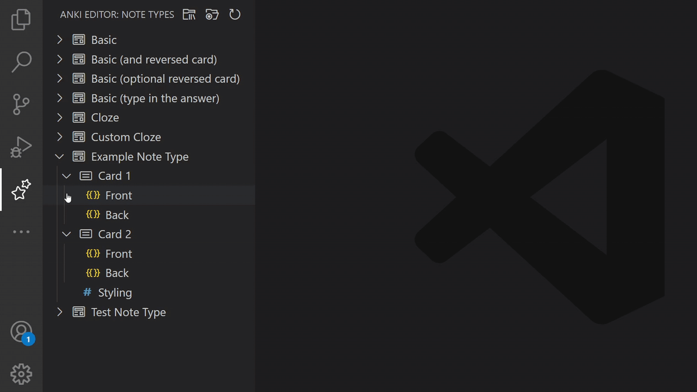

# Anki Editor

An extension for Visual Studio Code to edit [Anki](https://apps.ankiweb.net/) card templates through [Anki-Connect](https://ankiweb.net/shared/info/2055492159)
with syntax highlighting, autocomplete and other intellisense language features.


## Requirements

- [Anki](https://apps.ankiweb.net/) desktop application

- [Anki-Connect](https://ankiweb.net/shared/info/2055492159) add-on for Anki

- [Anki Preview Reloader](https://ankiweb.net/shared/info/571150035) add-on for Anki - Automatically reloads preview windows in Anki when card templates are updated through Anki-Connect.

- (optional) [AnkiWebView Inspector](https://ankiweb.net/shared/info/31746032) - Recommended because it completes the *"frontend development setup"* when editing card templates.

## Setup

1. Add [Anki-Connect](https://ankiweb.net/shared/info/2055492159) to Anki.
2. Install the extension from the [Visual Studio Code marketplace](https://marketplace.visualstudio.com/items?itemName=pedro-bronsveld.anki-editor).
3. Make sure Anki is running.
4. Click the double star icon in the activity bar on the left of VSCode to open the note type tree view.
5. Find the front or back of the card template you want to edit in the note type and card template tree hierarchy.

The steps above assume you're running VSCode and Anki on the same computer, and that Anki-Connect uses its default port and is listening on localhost.
If you're running over a network or have modified the Anki-Connect configuration, you may need to change some of the [extension settings](#extension-settings) to establish the connection between VSCode and Anki-Connect.

> Note: you may need to reload VSCode after installing the extension before file icons for `.template.anki` files become visible.

### Backup

While this extension has been tested, its functionality may break in unexpected ways after an update of Anki, VSCode, or other dependencies.
Because Anki Editor modifies card templates saved in your Anki collection, you should create a [backup](https://docs.ankiweb.net/backups.html) of your collection before using this or any other add-on that modifies your collection.

## Live Template Preview

When you're editing a card template in Anki's [template screen](https://docs.ankiweb.net/templates/intro.html#the-templates-screen), its preview is updated as you type.
However, this preview will not update when the card template is updated through Anki-Connect.

To solve this, the Anki add-on [Anki Preview Reloader](https://ankiweb.net/shared/info/571150035) was developed alongside Anki Editor.
When changes to a template are saved through Anki-Connect, this add-on will reload the preview in the card template screen, or the card preview window opened from the card editor.

## Standalone

Anki Editor can be used without Anki-Connect by creating a file with the extension `.template.anki`, or by setting the language mode for any file to "Anki Template".
You can then create your card template in this file, and manually copy it to Anki.
When using the extension this way, you will still get most intellisense features, except for those that depend on data from note types.
For example, validation of field names is unavailable, because this data has to be retrieved through Anki-Connect.

## Features

- Load card templates and stylesheets using a tree view of note types and card templates.
Save changes as if they're any other file.



- Completions for fields, special fields and filters inside field replacements.
Can be triggered using `Ctrl` + `Space` by default, when the cursor is inside a replacement.


- Error detection of possible syntax and model related errors inside field replacements.


- Quick fixes for some simple syntax errors.


- Documentation for special fields and filters when hovering over them.


- Renaming of linked conditional opening and closing tags.


- Detection of nested conditional problems.


- Completions of some built-in CSS classes in Anki when writing selectors in a card's stylesheet.


- Forwarding of HTML, CSS and Javascript intellisense to VSCode's language services.

- Syntax highlighting.

- Snippets for some field replacements and conditional blocks when the cursor is outside a field replacement.
Can be triggered using `Ctrl` + `Space` by default.

## Running on vscode.dev

[vscode.dev](https://vscode.dev/) is a version of Visual Studio Code that runs entirely in the browser.
Anki Editor can be installed and used on vscode.dev with some technical limitations and things to keep in mind:

A connection from Anki Editor running in vscode.dev to Anki-Connect can only be established when the browser and Anki are running on the same computer.
This is because of [mixed content](https://developer.mozilla.org/en-US/docs/Web/Security/Mixed_content#loading_locally_delivered_mixed-resources) limitations set by web browsers.

Because vscode.dev is seen as a foreign website that's trying to access your locally running Anki-Connect add-on, Anki-Connect will show a pop-up asking you to allow permission to allow cross origin requests from vscode.dev.


By clicking `Yes`, the origin that the Anki Editor extension is served from will be added to the `"webCorsOriginList"` property in the Anki-Connect configuration.
Unfortunately, because vscode.dev loads its content from a cdn, a different `*.vscode-cdn.net` origin is sent with requests to Anki Connect every time Anki Editor is loaded on vscode.dev.
As a result, the list of allowed cors origins in the Anki-Connect configuration grows every time the extension is loaded on vscode.dev.


This behavior can be prevented by setting the allowed origins to `"*"`.
However, this is not recommended, as it allows any website to interact with Anki-Connect without requesting permission.

```json
{
    // ...
    "webCorsOriginList": [
        "*"
    ]
}
```

When using Anki Editor on vscode.dev, all content is still transferred locally between Anki-Connect and Anki Editor.
This means none of your templates are sent to vscode.dev or other online services.

## Extension Settings

* `anki-editor.origin`: The url and port that Anki-Connect can be reached at. 
By default this is set to `"http://127.0.0.1:8765"`, which should allow VSCode to connect to Anki automatically when both applications are running on the same computer.

* `anki-editor.apiKey`: Optional api key that can be set in the Anki-Connect configuration.
Leave this empty if `"apiKey"` in the Anki-Connect configuration is set to `null`.

* `anki-editor.invalidFieldDiagnostics`: Enable or disable error detection of field names in template replacements.

* `anki-editor.missingFieldDiagnostics`: Enable or disable error detection of missing field names in template replacements.

* `anki-editor.invalidFilterDiagnostics`: Enable or disable error detection of filter names in template replacements.

* `anki-editor.customFieldNames`: Add extra field names that will be allowed in template replacements, and will be used for completion suggestions.
  This can be used when an Anki add-on is installed that adds extra special fields.

* `anki-editor.customFilterNames`: Add extra filter names that will be allowed in template replacements, and will be used for completion suggestions.
  This can be used when an Anki add-on is installed that adds extra filters.
  A custom filter can be defined as a string or an object.

  Example:
  ```json
  "anki-editor.customFilterNames": [
      "custom-filter1",
      {
          "name": "custom-filter2",
          "fieldRequired": true
      }
  ]
  ```

* `anki-editor.checkJsLevel`: Sets the level of type checking for embedded Javascript type errors.
  The values `"on"`, `"default"` and `"off"` correspond to the values `true`, `undefined` and `false` of the [`checkJs`](https://www.typescriptlang.org/tsconfig#checkJs) property in the TypeScript compiler options.

## Credits

Anki Editor was, in part, made possible by the following projects:

- [Anki](https://github.com/ankitects/anki) - A free and open-source program to create flashcards. Available on [apps.ankiweb.net](https://apps.ankiweb.net).
- [Anki-Connect](https://github.com/FooSoft/anki-connect) - Enabling communication with Anki over HTTP.
- [Autoanki](https://github.com/chenlijun99/autoanki)'s Anki-Connect package - A type wrapper for the Anki-Connect API.
- [ts-morph](https://github.com/dsherret/ts-morph)'s bootstrap package - Allowed for easy forwarding of Javascript language features to the Typescript language service.
- [AnkiWebView Inspector](https://github.com/hikaru-y/anki21-addon-ankiwebview-inspector) - Allowed for inspection of HTML rendered by Anki to find out which CSS classes should be suggested.
- The star in Anki Editor's icon and the icon in VSCode's activity bar is based on (but not a direct copy of) the star in Anki's logo, which was created by Alex Fraser.

## Disclaimer

Anki Editor was created to work together with Anki and the attributed projects listed above.
It is not developed by the Anki developers.
